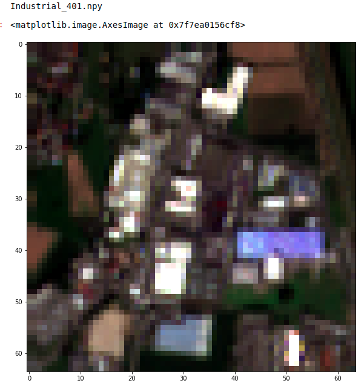
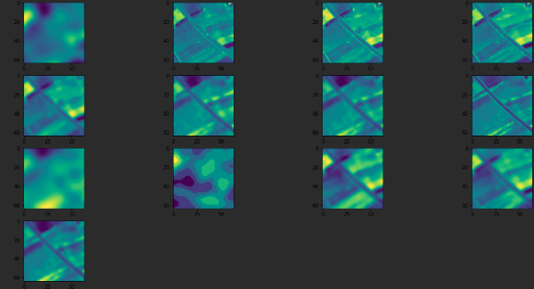
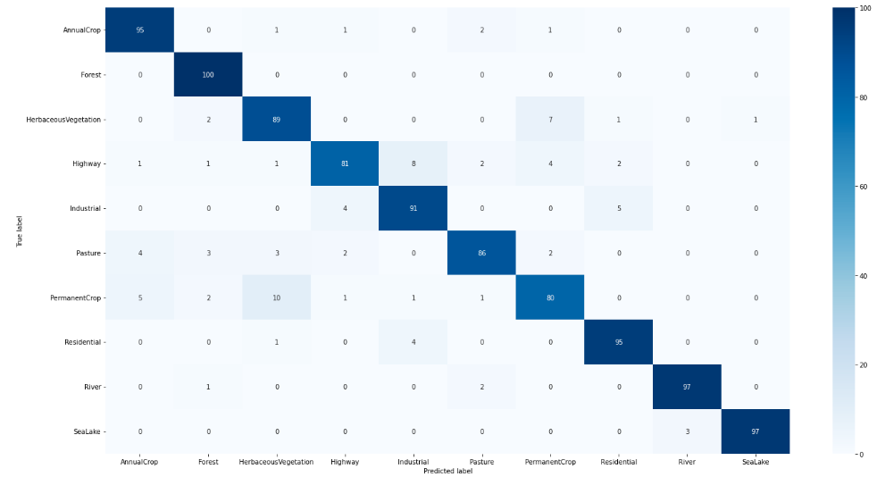

# multiclass-multiband-classification of satilite data

### This repository shows you how to handle multiband satellite data and train convolution neural network to predict 10 different types of surface.

#### PREPARE THE ENVIRONMENT
* install python 3.6.7 or higher is required
* install requirements.txt
* add absolute path to src root to .env (.env.example for example)

#### DATA
The dataset is based on Sentinel-2 satellite images covering 13 spectral bands and consisting out of 10 classes with in total 10,000 labeled and geo-referenced images.
link to original [paper](https://arxiv.org/abs/1709.00029)

easy download from [google drive ](https://drive.google.com/drive/folders/1VkVGsydyysKNxquWiR_YuM6Ym6ZkwlRs?usp=sharing)

#### PREPARE THE DATA
* download the data to src root
* run the **data_prep.ipynb** in src root
  * train dataset shape is (7500, 12)
  * validate dataset shape is (1500, 12)
  * test dataset shape is (1000, 12)
* to visualize the data with RGB bands run the **data_vis.ipynb**

* to visualize all bands run the "**notebooks/generator test.ipynb**"

#### TRAIN THE MODEL
There are few experiments:
* costume resnet for multispectral data - **"exp_resnet"** (test metrics _precision is 0.81, recall is 0.8, f1 is 0.8_)
* simple convolution nn - **"exp_main"** with _ReduceLROnPlateau_ learning rate annealing. (test metrics _precision is 0.91, recall is 0.91, f1 is 0.91_)
* simple convolution nn - **"exp_cos_lr_ann"** with _CosineAnnealingLR_ learning rate annealing.
  * Both works pretty well, but with _CosineAnnealingLR_ training is longer.
* unet + fully connected layers - **"exp_unet_fcl.2"**. (test metrics _precision is 0.92, recall is 0.92, f1 is 0.92_)

to run the training:
* run the train.py. Note that augmentation does not work with Sentinel-2 multispectral data.
* run tensorboard:
  * enter src folder
  * run command _"tensorboard --logdir logs/scalar"_

#### TEST THE MODEL
to run the testing:
* run "**notebooks/model test.ipynb**"
* to run resnet based model, first download weights from [gdrive](https://drive.google.com/file/d/1j6Z_q4tQjMgOQGLKwYWF1RXf6YliNKiy/view?usp=sharing)
* to run unet based model, first download weights from [gdrive](https://drive.google.com/file/d/1axRDVYDAdTOX_8JrHU1MyuUkI4Z1kPe4/view?usp=sharing)

Metrics on test dataset: precision is 0.92, recall is 0.92, f1 is 0.92

Confusion matrix on test dataset:

Easy to notice model struggling with vegetation recognition and industrial surface.